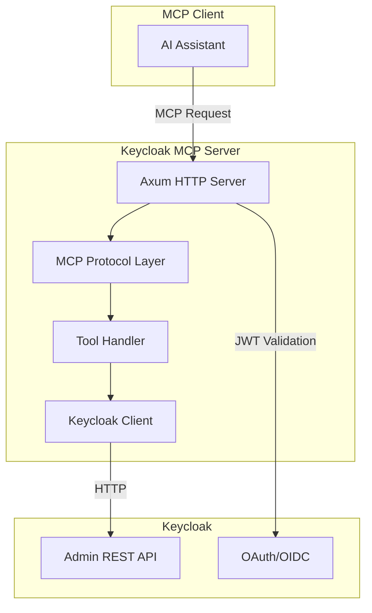
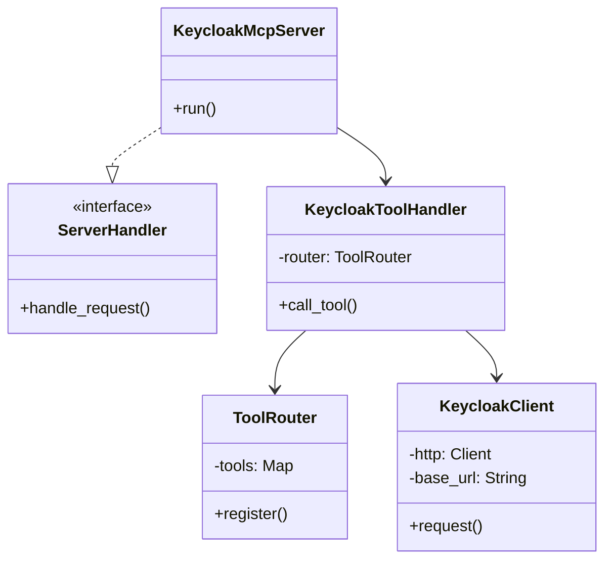
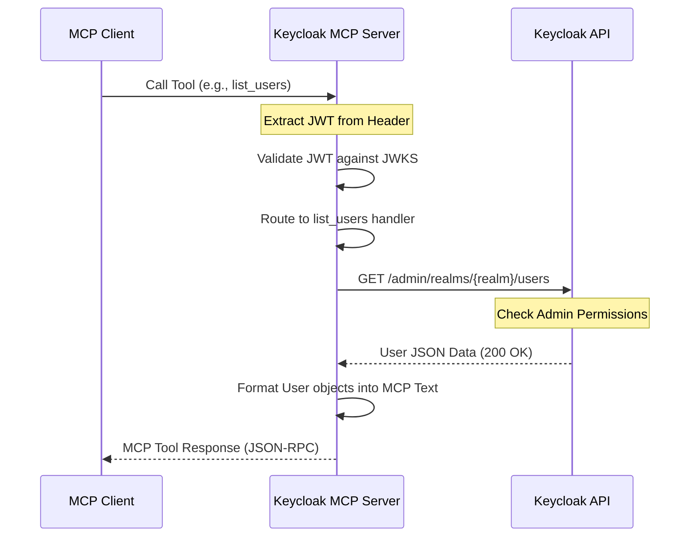
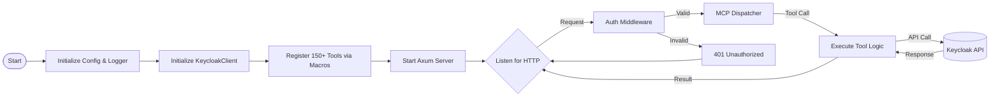

# Architecture

This document describes the high-level architecture of the Keycloak Model Context Protocol (MCP) Server. It outlines how the system components interact, the layered design approach, and the key technology choices that drive the implementation.

## System Overview

The Keycloak MCP Server acts as a bridge between AI assistants (MCP Clients) and the Keycloak Identity and Access Management system. It enables AI models to perform administrative tasks, manage users, configure realms, and inspect security settings through a standardized protocol.

### High-Level Flow

The server exposes an HTTP endpoint that accepts MCP requests over a streamable transport. Each request is validated against Keycloak's own authentication mechanisms before being processed by the tool dispatcher. This ensures that the AI assistant operates within the security context of a valid Keycloak user or service account.

## Layered Architecture

The project follows a modular, layered architecture to ensure separation of concerns and maintainability. Each layer has a specific responsibility and communicates with adjacent layers through well-defined interfaces.

### 1. Transport Layer
The outermost layer is built on the Axum framework. Unlike many MCP implementations that use stdio (standard input/output), this server utilizes HTTP to facilitate robust authentication and multi-user support.

- **Axum HTTP Server**: Handles TCP connections, TLS (if configured), and HTTP routing. It provides the industrial-grade foundation needed for a production-ready server.
- **StreamableHttpService**: A custom integration that manages the lifecycle of MCP sessions over HTTP. It handles the mapping of individual HTTP requests to long-lived MCP sessions, ensuring that stateful protocol operations (like session initialization) work correctly in a request-response environment.
- **JSON-RPC Over HTTP**: Implements the transport-specific parts of the MCP specification. It translates the raw HTTP body into the JSON-RPC 2.0 format expected by the protocol layer.
- **Multiplexing**: Support for handling multiple concurrent MCP sessions over the same HTTP listener, allowing different AI assistants or users to interact with the server simultaneously.

### 2. Protocol Layer
The protocol logic is managed by the `rmcp` SDK. This layer implements the core Model Context Protocol specification.

- **Message Parsing**: Deserializes JSON-RPC 2.0 messages into structured Rust types, handling all standard MCP methods such as `initialize`, `list_tools`, and `call_tool`.
- **Schema Validation**: Ensures that incoming tool calls provide the correct arguments and that the server's responses match the advertised JSON schemas. This prevents invalid data from reaching the handler layer.
- **Session Management**: Tracks active MCP sessions and their capabilities. It handles the initial handshake where the client and server agree on which features (tools, resources, prompts) are available.
- **Protocol Compliance**: Guarantees that all communication adheres to the strict MCP standard, ensuring compatibility with any compliant MCP client.

### 3. Handler Layer
The `KeycloakToolHandler` serves as the central orchestration point. It acts as the dispatcher for all Keycloak-specific operations.

- **ToolRouter**: A sophisticated registry that maps incoming MCP tool names (e.g., `keycloak_list_users`) to specific handler functions. The router is optimized for fast lookups and efficient routing.
- **Argument Extraction**: Unpacks tool arguments from the MCP payload and converts them into the internal types used by the client layer. It handles optional parameters, default values, and complex nested objects.
- **Error Handling & Translation**: Captures Keycloak API errors and translates them into meaningful MCP error codes. For example, a Keycloak 409 Conflict is translated into a descriptive MCP error that explains which resource already exists.
- **Result Formatting**: Converts the raw data returned by the client layer into `McpContent` objects, which may include text, JSON, or even image references if applicable.

### 4. Client Layer
The `KeycloakClient` is a specialized HTTP client built on the `reqwest` library. It encapsulates the low-level details of the Keycloak Admin REST API.

- **Base URL Management**: Handles URL construction for different realms and resources, ensuring that calls are routed to the correct Keycloak endpoint (e.g., `/admin/realms/{realm}/users`).
- **Header Management**: Automatically attaches authorization headers, sets correct content types (usually `application/json`), and manages user-agent strings for identifying the server.
- **Retry Logic & Connection Pooling**: Implements transient failure handling for network requests and maintains a pool of persistent connections to the Keycloak server to minimize latency and improve throughput.
- **Deserialization**: Converts raw JSON responses from Keycloak into typed Rust structures using `serde`. It handles various response formats, including lists, single objects, and empty responses.

### 5. Auth Layer
The authentication layer provides the security perimeter for the server, ensuring that only authorized entities can access the MCP tools.

- **JWT Middleware**: Validates incoming Bearer tokens from the MCP Client. It checks for token expiration, issuer validity, and audience match against the configured Keycloak realm.
- **JWKS Integration**: Periodically fetches and caches JSON Web Key Sets from Keycloak. This allows the server to verify token signatures locally using RSA or EC public keys, avoiding a high-latency round-trip to the auth server for every request.
- **Token Delegation**: Ensures that the identity of the caller is preserved when interacting with the Admin API. This allows Keycloak's own RBAC (Role-Based Access Control) to be enforced at the source, providing deep security.

## Component Relationships

The following diagram illustrates the structural relationships between the core Rust components and how they implement the necessary traits.

### Component Roles in Detail
- **KeycloakMcpServer**: This is the application container. It is responsible for reading configuration from the environment, initializing the logging system, and starting the Axum server. It acts as the glue between the HTTP transport and the MCP protocol logic.
- **ServerHandler**: This trait is the primary interface for the MCP protocol. The server implementation handles the "wire" format and delegates the "intent" to the tool handler. It provides a clean separation between how messages are transported and how they are processed.
- **KeycloakToolHandler**: This is the heart of the logic. It maintains the registry of over 150 administrative tools. It is designed to be highly extensible, allowing for easy addition of new Keycloak API endpoints.
- **KeycloakClient**: A wrapper around the `reqwest::Client` that adds Keycloak-specific behaviors. It abstracts away the complexities of the Admin REST API's URL structure and error reporting.

## Data Flow and Interaction

When an AI assistant requests a tool execution, the following sequence occurs to ensure safety, correctness, and auditability.

### Sequence Diagram: User Listing Example

### Internal Component Lifecycle

## Tool Registration and Metadata

To manage the massive surface area of the Keycloak Admin API (150+ tools), the server employs a declarative macro system.

### Macro-Based Tool Registration
- **Consistency**: Every tool follows the same registration pattern, reducing the "cognitive load" for developers adding new features.
- **Auto-Discovery**: Tools are registered at compile-time. When the client calls `list_tools`, the server automatically generates the correct JSON schemas from the Rust function signatures, including descriptions and required fields.
- **Type Safety**: Macros ensure that the handler functions match the signatures expected by the dispatcher, catching parameter mismatches at compile time rather than runtime.
- **Metadata Generation**: Each tool includes rich metadata that describes its purpose, allowing the AI to understand when and how to use it effectively.

## Key Design Decisions

### HTTP Transport for OAuth 2.1
While the MCP specification supports stdio, we chose HTTP to align with Keycloak's web-native nature and enterprise requirements.
- **Centralized Auth**: Using Keycloak to protect the MCP server itself. This means you can use the same identity system to manage the tools that manage the identity system.
- **Statelessness**: The server doesn't need to track session state in local memory or a database; the JWT carries all necessary information for authorization and auditing.
- **Deployment Flexibility**: The server can run in modern cloud environments like Kubernetes or Serverless containers and be accessed by remote AI agents across the internet or a private VPC.

### Token Delegation and Security
The server operates on the principle of "Least Privilege" and deep integration with Keycloak security.
- **No Master Credentials**: The server does not store sensitive master admin passwords. It relies on the token provided by the caller or a specifically scoped service account.
- **RBAC Enforcement**: If the user calling the MCP tool doesn't have "view-users" permissions in Keycloak, the API call will fail with a 403 Forbidden, and the AI will be informed of this restriction.
- **Auditing**: Every action performed by the AI is recorded in Keycloak's own audit logs as being performed by the specific user who authorized the MCP session, ensuring clear accountability.

### Asynchronous Runtime and Concurrency
The entire stack is built on the `tokio` runtime to handle high-concurrency workloads.
- **High Throughput**: The server can handle thousands of concurrent requests with minimal CPU and memory overhead, making it suitable for large-scale enterprise deployments.
- **Resource Efficiency**: Non-blocking I/O ensures that threads aren't wasted waiting for network responses from Keycloak, allowing for efficient use of container resources.
- **Modern Ecosystem**: Leveraging `tokio` gives the project access to the best-in-class libraries for HTTP (`axum`), JSON (`serde`), and logging (`tracing`).

## Technology Stack

The project uses a curated selection of high-quality Rust crates to ensure security, performance, and maintainability.

| Component | Technology | Purpose |
|-----------|------------|---------|
| Runtime | Tokio 1.x | Async execution and task management. The industry standard for high-performance Rust. |
| HTTP Server | Axum 0.8 | Routing and request handling. Built on top of `tower` and `hyper` for maximum compatibility and extensibility. |
| MCP SDK | rmcp 0.8 | Protocol implementation. Handles the nuances of the Model Context Protocol, including session states. |
| HTTP Client | reqwest 0.12 | Communication with the Keycloak Admin API. Supports connection pooling, automatic compression, and async I/O. |
| JWT | jsonwebtoken | Secure token validation. Handles RSA and EC signatures used by Keycloak for verifying client identity. |
| Serialization | Serde | Data transformation. The backbone for both MCP protocol messages and Keycloak API entities. |
| Logging | Tracing | Structured logging and diagnostic information for debugging, auditing, and performance monitoring. |
| Environment | Dotenvy | Configuration management via environment variables, ensuring easy deployment in containerized environments. |

## Error Management Strategy

Errors are categorized and handled at each layer to provide the best possible feedback to both the AI and the system administrators:
- **Network Errors**: Handled by `reqwest` and mapped to MCP internal errors with details about the connection failure (e.g., timeout, DNS failure).
- **Auth Errors**: Handled by `axum` middleware and mapped to standard 401/403 HTTP codes, preventing unauthorized access before the protocol layer is reached.
- **Protocol Errors**: Handled by `rmcp` and mapped to standard JSON-RPC codes (e.g., -32601 for Method Not Found or -32602 for Invalid Params).
- **Application Errors**: Keycloak API errors (4xx/5xx) are parsed to extract the `errorMessage` field provided by Keycloak. This specific error message is passed back to the AI, allowing it to understand *why* a request failed (e.g., "Username already exists" or "Client ID mismatch").

## Scalability and Performance

The stateless nature of the architecture is its greatest strength for scalability and operational reliability.
- **Horizontal Scaling**: Multiple instances of the Keycloak MCP Server can run behind a standard load balancer. Since there is no local state, any instance can handle any request from any client.
- **Caching**: The server implements aggressive caching for semi-static data like JWKS and Realm configurations to reduce the load on the Keycloak instance and improve response times for frequently used tools.
- **Connection Management**: Persistent connections to Keycloak are maintained via `reqwest`'s internal pool, significantly reducing the overhead of TLS handshakes for repeated tool calls and improving overall system latency.

## Future Considerations

The architecture is designed to support future enhancements as the MCP specification and Keycloak continue to evolve:
- **SSE Support**: While currently using standard HTTP POST, the architecture can easily transition to Server-Sent Events (SSE) for streaming long-running responses or real-time event notifications.
- **Custom Tool Extensions**: The `ToolRouter` is designed to allow developers to add custom, non-Keycloak tools without modifying the core protocol logic, enabling specialized extensions.
- **Enhanced Observability**: Future integration with OpenTelemetry will provide distributed tracing across the entire AI -> MCP -> Keycloak path, giving developers deep insights into performance and error rates.
- **Schema Evolution**: The use of `serde` and a flexible tool registration system ensures that the server can gracefully handle future updates to the Keycloak Admin API and the MCP specification.

---
*Note: This document focuses on high-level architecture. For specific tool implementations, see [API Reference](05-api-reference.md). For deployment instructions, see [Getting Started](01-getting-started.md).*
