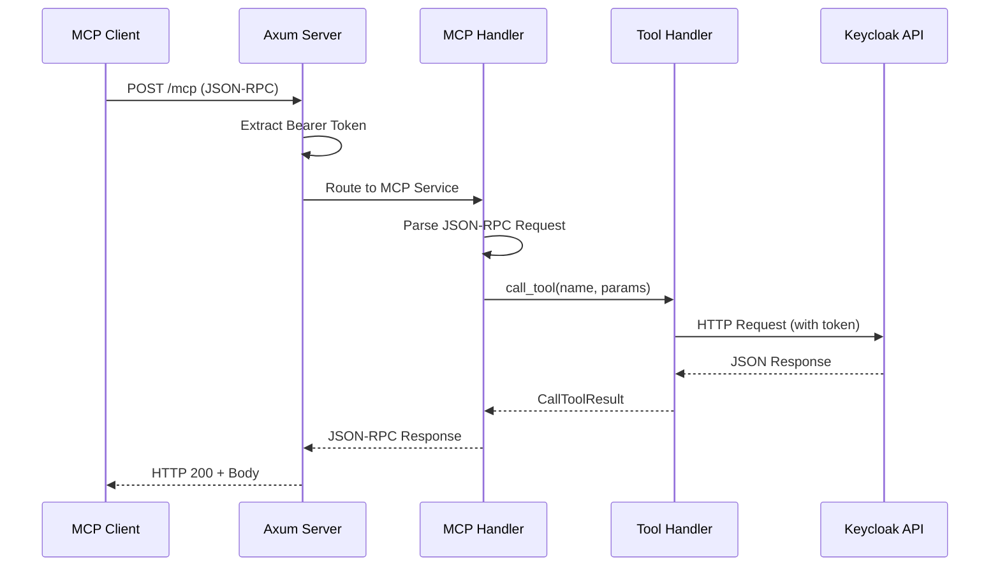
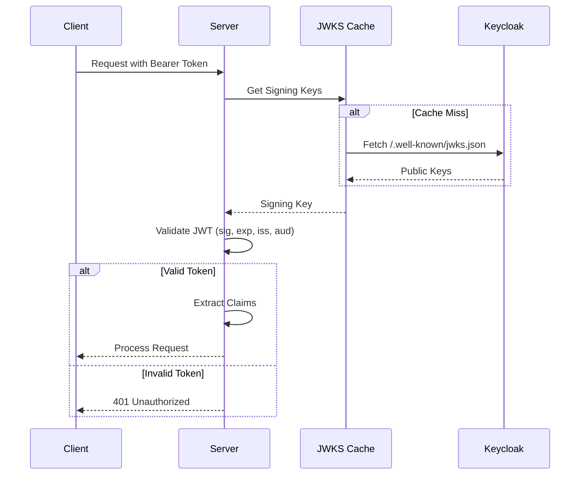

# Request Flow

This document describes the end-to-end request flow within the Keycloak MCP Server, from the initial client request to the final response returned after interacting with the Keycloak Admin API. It outlines how the server handles JSON-RPC messages, manages authentication, and dispatches tool executions.

## Overview

The Keycloak MCP Server acts as a bridge between an MCP client (such as Claude Desktop, Goose, or a custom IDE integration) and the Keycloak Admin API. It exposes Keycloak management capabilities as MCP tools, ensuring that every request is authenticated and authorized via JWT. The server is built on top of the Axum web framework for HTTP transport and uses a custom implementation of the MCP protocol.

## MCP Request Lifecycle

The following sequence diagram illustrates the complete lifecycle of an MCP request, starting from the JSON-RPC call over HTTP to the final response.



### Flow Steps

1. **HTTP Request Received**: The Axum server listens for incoming POST requests on the `/mcp` endpoint. All communication follows the JSON-RPC 2.0 specification over HTTP.
2. **Bearer Token Extraction**: The `auth_middleware` (defined in `src/auth/middleware.rs`) extracts the Bearer token from the `Authorization` header. If the header is missing or malformed, the request is rejected immediately.
3. **JWT Validation**: The extracted token is validated against the Keycloak JWKS endpoint. This ensures the token is signed by a trusted authority and has not expired.
4. **Service Routing**: Validated requests are routed to the `StreamableHttpService`, which handles the mapping between HTTP and the internal MCP service logic.
5. **JSON-RPC Parsing**: The MCP handler parses the incoming JSON-RPC 2.0 request to identify the method (e.g., `tools/call`, `resources/list`) and its associated parameters.
6. **Tool Dispatch**: If the method is `tools/call`, the `call_tool` implementation (found in `src/mcp/server.rs:72-79`) dispatches the request to the appropriate tool handler based on the `name` parameter.
7. **Keycloak API Interaction**: The tool handler uses the `KeycloakClient` (implemented in `src/api/client.rs:41-53`) to perform the requested operation against the Keycloak Admin API. It passes the user's Bearer token in the outgoing request to ensure that Keycloak's own RBAC is enforced.
8. **Response Formatting**: The API response (usually JSON) is processed by the tool handler. It is then wrapped in a `CallToolResult` object, which may include text content or image data as per the MCP spec.
9. **Final Delivery**: The MCP handler encapsulates the result in a JSON-RPC response, and the Axum server returns it to the client with an HTTP 200 OK status.

## Authentication Flow

Authentication is a critical component of the request flow, handled via dedicated middleware that ensures every request carries a valid JWT issued by the configured Keycloak instance.



### Validation Process

- **Signature Verification**: The server uses public keys fetched from Keycloak's JWKS (JSON Web Key Set) endpoint to verify the JWT signature. This confirms that the token has not been tampered with.
- **Expiration Check**: The `exp` claim is checked to ensure the token is still within its validity period.
- **Issuer and Audience**: The `iss` (issuer) and `aud` (audience) claims are validated against the server's environment configuration to ensure the token was issued by the expected Keycloak realm for the correct client.
- **Caching Strategy**: To minimize latency and avoid overloading the Keycloak server, the JWKS keys are cached locally. The cache is refreshed automatically if a token arrives with an unknown key ID (`kid`) or after a configurable TTL.

## Internal Execution Pattern

The server uses a structured approach for tool execution, often leveraging macros to reduce boilerplate and ensure consistency across different management functions. For instance, the `impl_list_tool` macro in `src/mcp/tools.rs:200-217` standardizes how collection-based resources like users, roles, or clients are fetched.

```rust
// Conceptual execution pattern
async fn execute_tool(client: &KeycloakClient, args: Arguments) -> Result<CallToolResult, Error> {
    // 1. Interact with Keycloak
    let response = client.get_users(args.realm).await?;
    
    // 2. Transform to MCP format
    let content = format_as_text(response);
    
    // 3. Return result
    Ok(CallToolResult::new(content))
}
```

This pattern ensures that every tool benefits from centralized error handling, logging, and performance monitoring.

## Error Handling

The server implements a robust error handling strategy to provide meaningful feedback to the client while maintaining security and preventing information leakage.

| Error Condition | HTTP Status | JSON-RPC Error | Description |
|-----------------|-------------|----------------|-------------|
| Missing Token | 401 | N/A | No Authorization header provided in the request. |
| Invalid Token | 401 | N/A | Token failed signature, expiration, or claim checks. |
| Unknown Tool | 200 | -32601 | The requested tool name does not exist in the registry. |
| Invalid Params | 200 | -32602 | Parameters do not match the expected schema for the tool. |
| Keycloak Down | 200 | -32000 | The Keycloak API is unreachable or returned a 5xx error. |
| Resource Missing| 200 | -32000 | Keycloak returned 404 for a specific ID or realm. |

### Detailed Error Scenarios

- **401 Unauthorized**: Returned immediately by the authentication middleware. The request is aborted before it reaches any MCP logic, ensuring that unauthorized users cannot even discover available tools.
- **404 Not Found (Tool)**: If the `call_tool` dispatcher cannot find a matching tool name in its internal map, it returns a standard JSON-RPC "Method not found" error.
- **400 Bad Request (Parameters)**: If the parameters provided by the client fail to deserialize into the expected tool arguments (e.g., a missing required field or invalid type), an "Invalid params" error is returned.
- **500 Internal Error**: Captured during tool execution. If the Keycloak API returns a server error, the tool handler catches the exception and translates it into a JSON-RPC internal error. The message returned to the client is sanitized to avoid exposing sensitive internal state.

## Example Payloads

### Tool Call Request

The following example shows an MCP client requesting a list of users from the 'master' realm.

```json
{
  "jsonrpc": "2.0",
  "id": 1,
  "method": "tools/call",
  "params": {
    "name": "user_list",
    "arguments": {
      "realm": "master"
    }
  }
}
```

### Successful Response

The server returns a formatted list of users retrieved from the Keycloak API.

```json
{
  "jsonrpc": "2.0",
  "id": 1,
  "result": {
    "content": [
      {
        "type": "text",
        "text": "Users in realm 'master':\n- admin (ID: 550e8400-e29b-41d4-a716-446655440000)\n- readonly-user (ID: 6ba7b810-9dad-11d1-80b4-00c04fd430c8)"
      }
    ]
  }
}
```

### Error Response (Tool Not Found)

If the client requests a tool that has not been registered or is misspelled.

```json
{
  "jsonrpc": "2.0",
  "id": 1,
  "error": {
    "code": -32601,
    "message": "Method not found: user_get_details"
  }
}
```

### Error Response (Keycloak API Error)

If Keycloak returns an error (e.g., the specified realm does not exist), the server captures this as a tool-level failure.

```json
{
  "jsonrpc": "2.0",
  "id": 1,
  "result": {
    "content": [
      {
        "type": "text",
        "text": "Error: Keycloak API returned 404 Not Found for realm 'invalid-realm'"
      }
    ],
    "isError": true
  }
}
```

## Component Interaction

### Axum and MCP Handler
Axum serves as the high-performance HTTP engine. It handles connection management, TLS (if configured), and request routing. The MCP handler sits behind Axum, focusing purely on the semantics of the Model Context Protocol. This separation ensures that the core logic can be easily adapted to different transports if needed.

### Keycloak Client
The `KeycloakClient` is the sole point of contact for the Keycloak API. It encapsulates all logic related to URL construction, header management, and response parsing. It is designed to be reusable across different tool implementations, providing a clean interface for data fetching and modification.

### Tool Registry
At startup, the server initializes a registry of all available tools. Each tool defines its own metadata (name, description, input schema) and an execution function. When a request arrives, the registry is consulted to find the appropriate logic to run.

## Conclusion

The request flow in the Keycloak MCP Server is designed for security, predictability, and compliance with the MCP specification. By leveraging robust middleware and a clear separation of concerns between transport, protocol, and API interaction layers, the server provides a reliable management interface for Keycloak environments.
