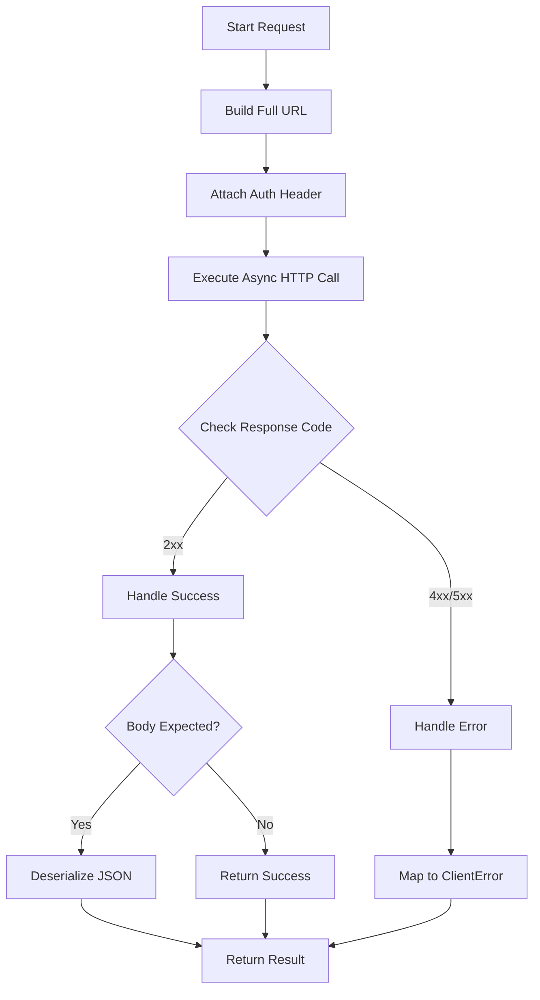

# KeycloakClient Component

The `KeycloakClient` is the foundational component for communicating with the Keycloak Admin REST API. It provides a high-level, asynchronous abstraction over raw HTTP requests, handling authentication, serialization, and error management.

## Purpose

The `KeycloakClient` acts as the bridge between the MCP tool handlers and the Keycloak server. It encapsulates the complexities of:
- Managing the base URL and API paths.
- Injecting required authentication headers (Bearer tokens).
- Mapping HTTP response codes to domain-specific errors.
- Handling paginated responses common in Keycloak list operations.

## Construction

The client is typically instantiated once and shared across the application.

### new()

The standard constructor initializes the client with a base URL and default settings.

```rust
pub fn new(base_url: String) -> Self {
    let client = reqwest::Client::builder()
        .user_agent("Keycloak-MCP-Server/1.0")
        .build()
        .expect("Failed to create HTTP client");
    
    Self {
        client,
        base_url,
    }
}
```

### with_client()

If a pre-configured `reqwest::Client` is required (e.g., for custom proxy settings or timeouts), the `with_client` method allows injecting an existing instance.

```rust
pub fn with_client(client: reqwest::Client, base_url: String) -> Self {
    Self { client, base_url }
}
```

## HTTP Interaction Methods

The client provides several methods corresponding to the RESTful actions required by the Keycloak Admin API.

### GET Requests

- **get<T>(path: &str)**: Performs a GET request and deserializes the JSON response into type `T`.
- **get_paginated<T>(path: &str, first: Option<i32>, max: Option<i32>)**: Specifically handles list endpoints that support `first` and `max` query parameters for pagination.

### Modification Requests

- **post<T, B>(path: &str, body: B)**: Sends a POST request with a JSON body and returns the deserialized response `T`.
- **post_no_response<B>(path: &str, body: B)**: Used for POST actions where Keycloak returns a 201 Created or 204 No Content without a response body.
- **put<B>(path: &str, body: B)**: Performs a PUT request to update an existing resource.
- **delete(path: &str)**: Sends a DELETE request.
- **delete_with_body<B>(path: &str, body: B)**: Sends a DELETE request with a JSON body (used in specific Keycloak endpoints).

## Request Flow

The following flowchart demonstrates the lifecycle of a typical request within the `KeycloakClient`.



## Authentication Handling

The client automatically handles token injection. It expects an authentication provider or a valid token to be available during request construction.

### Token Injection

For every request, the `Authorization` header is set:

```rust
let request = self.client
    .get(url)
    .header("Authorization", format!("Bearer {}", token));
```

This ensures that all interactions with the Admin API are authorized with the necessary credentials.

## Pagination Logic

Keycloak's list endpoints often return large sets of data. The `KeycloakClient` simplifies access to these through `get_paginated`.

```rust
pub async fn get_paginated<T: DeserializeOwned>(
    &self,
    path: &str,
    first: Option<i32>,
    max: Option<i32>,
) -> Result<Vec<T>, ClientError> {
    let mut url = self.build_url(path);
    if let Some(f) = first { url.query_pairs_mut().append_pair("first", &f.to_string()); }
    if let Some(m) = max { url.query_pairs_mut().append_pair("max", &m.to_string()); }
    
    self.get(url.as_str()).await
}
```

## Error Management

The client includes internal logic to handle various failure modes of the Keycloak API.

### handle_response()

Validates that the response code is within the 200-299 range. If not, it triggers error handling.

### handle_error()

This method inspects the response body and status code to produce a meaningful `ClientError`.

```rust
async fn handle_error(response: Response) -> ClientError {
    let status = response.status();
    let body = response.text().await.unwrap_or_default();
    
    match status {
        StatusCode::UNAUTHORIZED => ClientError::AuthenticationFailed(body),
        StatusCode::FORBIDDEN => ClientError::PermissionDenied(body),
        StatusCode::NOT_FOUND => ClientError::ResourceNotFound(body),
        _ => ClientError::ApiError(status, body),
    }
}
```

This mapping allows the MCP server to provide specific feedback to the LLM, such as "Resource not found" instead of a generic "Internal error".

## Summary of Usage

The `KeycloakClient` is used by the `KeycloakToolHandler` to perform the actual work requested by tools. For example, a `get_user` tool would call `client.get("/users/{id}")`, and a `create_realm` tool would call `client.post_no_response("/realms", realm_data)`.
