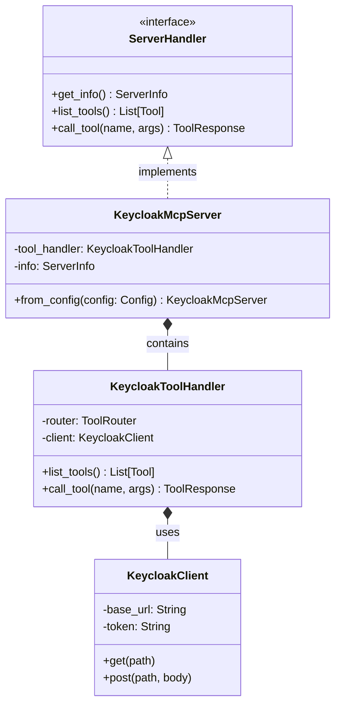

# Keycloak MCP Server Component

The `KeycloakMcpServer` is the central component of the Keycloak MCP Server. It acts as the primary entry point for all Model Context Protocol (MCP) communications, orchestrating the interaction between the MCP transport layer and the internal Keycloak administration logic.

## Purpose

The primary purpose of the `KeycloakMcpServer` is to implement the `ServerHandler` trait, which defines how an MCP server should respond to lifecycle events and tool-related requests. By encapsulating the server logic within this component, the system maintains a clean separation of concerns between protocol handling and domain-specific tool execution.

## Key Structure

The core of this component is the `KeycloakMcpServer` struct.

```rust
pub struct KeycloakMcpServer {
    /// The tool handler responsible for managing and executing Keycloak tools.
    tool_handler: KeycloakToolHandler,
    /// Server information including name, version, and capabilities.
    info: ServerInfo,
}
```

### Fields

- **tool_handler**: An instance of `KeycloakToolHandler`. All tool-related requests (listing and calling) are delegated to this internal handler. It maintains the registry of available tools and their respective logic.
- **info**: A `ServerInfo` struct that identifies the server to the client. It contains metadata such as the server's name ("Keycloak MCP Server") and its current version.

## ServerHandler Trait Implementation

The `ServerHandler` trait is the core interface for MCP servers. `KeycloakMcpServer` provides a robust implementation of this trait.

### get_info()

The `get_info` method returns the `ServerInfo` for the MCP server. This includes the server's identity and its declared capabilities.

```rust
async fn get_info(&self) -> Result<ServerInfo, McpError> {
    Ok(self.info.clone())
}
```

Capabilities typically include `tools` and potentially `resources` or `prompts`, though the primary focus of this server is the extensive toolset for Keycloak administration.

### list_tools()

This method returns a list of all tools supported by the server. It delegates the retrieval of the tool list to the internal `tool_handler`.

```rust
async fn list_tools(&self) -> Result<Vec<Tool>, McpError> {
    Ok(self.tool_handler.list_tools())
}
```

The returned `Tool` objects describe the tool's name, description, and input schema, allowing the MCP client (and the LLM using it) to understand how to interact with the server.

### call_tool()

When a client requests the execution of a specific tool, the `call_tool` method is invoked. It passes the tool name and arguments to the `tool_handler`.

```rust
async fn call_tool(
    &self,
    name: &str,
    arguments: Value,
) -> Result<ToolResponse, McpError> {
    self.tool_handler.call_tool(name, arguments).await
}
```

This method handles the dispatching of commands to the appropriate Keycloak Admin API endpoints through the client infrastructure.

## Component Relationships

The following class diagram illustrates the relationships between `KeycloakMcpServer` and its primary collaborators.



## Configuration

The server is configured using a `Config` struct, which typically includes the Keycloak base URL, authentication credentials, and server-specific settings.

```rust
pub struct Config {
    pub base_url: String,
    pub realm: String,
    pub auth: AuthConfig,
    pub server_info: Option<ServerInfo>,
}
```

### from_config()

The standard way to initialize the server is through the `from_config` constructor. This method performs the necessary setup of the internal components, including the HTTP client and the tool registry.

```rust
impl KeycloakMcpServer {
    pub fn from_config(config: Config) -> Self {
        let client = KeycloakClient::new(config.base_url, config.auth);
        let tool_handler = KeycloakToolHandler::new(client);
        let info = config.server_info.unwrap_or_else(|| ServerInfo {
            name: "Keycloak MCP Server".to_string(),
            version: env!("CARGO_PKG_VERSION").to_string(),
        });

        Self {
            tool_handler,
            info,
        }
    }
}
```

## Lifecycle Management

The `KeycloakMcpServer` does not maintain long-lived state other than its internal client and configuration. This makes it suitable for various MCP transport mechanisms, including:

1.  **Stdio**: Standard input/output communication for local use.
2.  **SSE (Server-Sent Events)**: For web-based or remote MCP integrations.

When the server starts, it initializes the `tool_handler`, which in turn registers all tools using the macro-based tool system. This ensures that the server is immediately ready to handle requests upon startup.

## Error Handling

Errors within the `KeycloakMcpServer` are mapped to the `McpError` type. This ensures that any issues during tool execution (e.g., Keycloak API errors, authentication failures, or invalid tool arguments) are communicated back to the MCP client in a standardized format.

Common error scenarios handled include:
- **ToolNotFound**: Requested tool is not in the registry.
- **InvalidParams**: Arguments do not match the tool's JSON schema.
- **InternalError**: Unexpected failures during API communication.

By centralizing the error handling, the server provides a consistent and reliable interface for clients, even when the underlying Keycloak service experiences issues.
