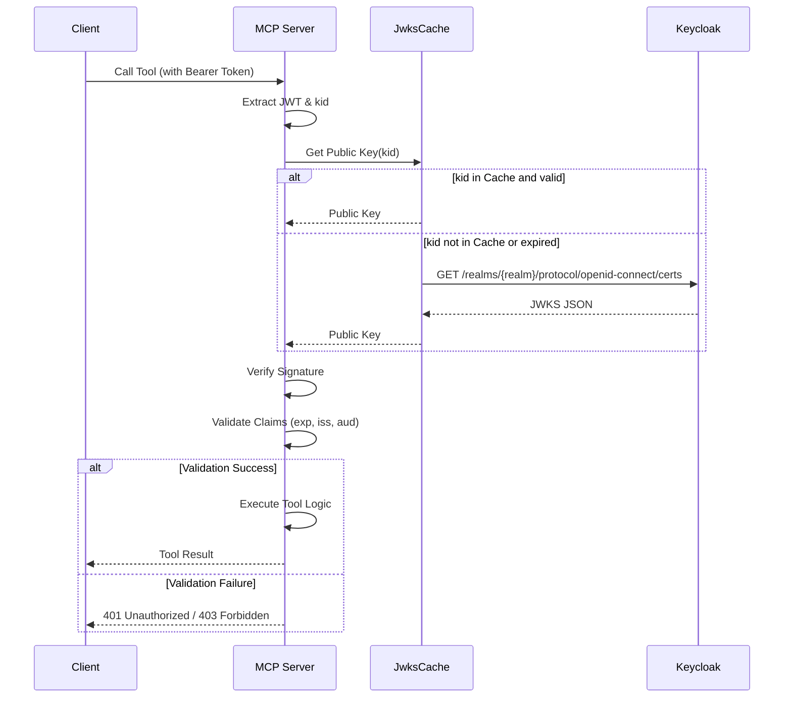

# OAuth 2.1 Authentication Component

The OAuth 2.1 authentication component provides robust security for the Keycloak MCP Server, ensuring that only authorized clients and users can access the sensitive administration tools. It adheres to modern security standards, implementing JWT validation and resource protection.

## Purpose

This component handles the validation of incoming authentication tokens and the enforcement of access control policies based on roles and scopes. It integrates directly with Keycloak's own security features, utilizing JSON Web Key Sets (JWKS) for cryptographic verification of tokens.

## JWT Validation Flow

The `JwtValidator` is the primary orchestrator for token verification. When a request arrives with a Bearer token, the validator performs several checks.

### Verification Steps

1.  **Header Extraction**: Retrieves the `kid` (Key ID) from the JWT header.
2.  **JWKS Lookup**: Fetches the public key corresponding to the `kid` from the cached JWKS.
3.  **Signature Verification**: Uses the public key to verify the JWT's cryptographic signature.
4.  **Claims Validation**: Inspects the payload for expiration (`exp`), issuer (`iss`), and audience (`aud`).
5.  **Role/Scope Extraction**: Parses custom claims to extract user roles and granted scopes.

## Claims Structure

The `Claims` struct defines the expected structure of the JWT payload, including both standard OIDC claims and Keycloak-specific fields.

```rust
#[derive(Debug, Serialize, Deserialize)]
pub struct Claims {
    // Standard Claims
    pub sub: String,
    pub iss: String,
    pub aud: Value,
    pub exp: i64,
    pub iat: i64,
    
    // Keycloak Specific
    pub azp: String,
    pub scope: String,
    pub realm_access: Option<RealmAccess>,
    pub resource_access: Option<HashMap<String, ResourceAccess>>,
    
    // Custom context
    pub preferred_username: Option<String>,
    pub email: Option<String>,
}
```

## JWKS Caching with JwksCache

To avoid making an HTTP request to Keycloak for every token validation, the server uses a `JwksCache`.

### Characteristics

- **TTL-based**: Public keys are cached with a Time-To-Live (TTL), typically 1 hour.
- **Async Refresh**: When a `kid` is not found or the cache has expired, the component asynchronously fetches the latest keys from Keycloak's `.well-known/jwks.json` endpoint.
- **Thread-safe**: The cache is designed for concurrent access, ensuring performance under high load.

## Authentication Middleware

The server provides middleware to simplify the protection of tool execution endpoints.

### auth_middleware

Requires a valid JWT for the request to proceed. If the token is missing or invalid, it returns a 401 Unauthorized error immediately.

### optional_auth_middleware

Validates the token if present, but allows the request to proceed if missing. The `Claims` object is stored in the request context as an `Option<Claims>`, allowing downstream logic to decide how to handle unauthenticated users.

## Access Control Logic

Beyond basic validation, the component provides utilities for fine-grained access control.

### require_role()

Ensures that the authenticated user possesses a specific realm or client role.

```rust
pub fn require_role(claims: &Claims, role: &str) -> Result<(), AuthError> {
    if claims.realm_access.as_ref().map_or(false, |ra| ra.roles.contains(&role.to_string())) {
        Ok(())
    } else {
        Err(AuthError::InsufficientPermissions(format!("Missing role: {}", role)))
    }
}
```

### require_scope()

Checks if the token was issued with the necessary OAuth scopes.

```rust
pub fn require_scope(claims: &Claims, required_scope: &str) -> Result<(), AuthError> {
    let scopes: Vec<&str> = claims.scope.split_whitespace().collect();
    if scopes.contains(&required_scope) {
        Ok(())
    } else {
        Err(AuthError::InsufficientScopes(format!("Missing scope: {}", required_scope)))
    }
}
```

## Auth Flow Sequence Diagram

The following diagram illustrates the interaction between a client, the MCP server, and Keycloak during the authentication process.



## RFC 9728 Protected Resource Metadata

The server implements aspects of RFC 9728, providing a metadata endpoint that describes the security requirements of the resource. This allows clients to discover:
- Supported authentication schemes (Bearer).
- Required scopes for different tools.
- The location of the authorization server (Keycloak).

## AuthError Variants

The `AuthError` enum provides specific feedback for various authentication and authorization failures:

- **MissingToken**: No Authorization header found.
- **InvalidToken**: JWT is malformed or signature verification failed.
- **ExpiredToken**: The `exp` claim is in the past.
- **InvalidIssuer**: The `iss` claim does not match the configured Keycloak URL.
- **InsufficientPermissions**: The user lacks the required roles.
- **InsufficientScopes**: The token lacks the required scopes.

These errors are captured and returned to the MCP client, providing clear instructions on why a request was denied.
