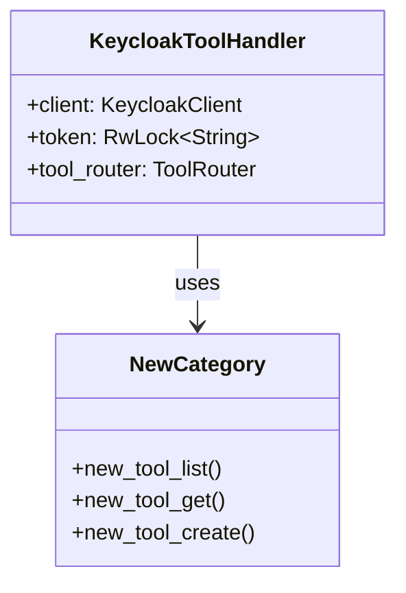

# Extending Keycloak MCP

This guide provides technical instructions for contributors who wish to extend the Keycloak MCP server with new API categories and tools.

## Architecture Overview

Keycloak MCP is designed with a modular architecture that separates the MCP protocol handling from the Keycloak API implementation.



The extension points are primarily located in:
- `src/api/`: Keycloak API client implementation.
- `src/mcp/tools.rs`: MCP tool registration and parameter mapping.

## Adding a New API Category

To add support for a new Keycloak functional area (e.g., Groups, Identity Providers), follow these steps:

1.  **Create the Module**: Create a new directory `src/api/{category}/`.
2.  **Define Types**: Create `src/api/{category}/types.rs` for DTOs and parameter structs. Ensure they derive `Serialize`, `Deserialize`, and `JsonSchema`.
3.  **Implement API**: Create `src/api/{category}/mod.rs` and implement the async functions that interact with Keycloak.
4.  **Export the Category**: Add `pub mod {category};` to `src/api/mod.rs`.

### Example API Structure

```rust
// src/api/groups/mod.rs
use crate::api::client::KeycloakClient;
use crate::api::error::ApiError;
use crate::api::groups::types::{GroupRepresentation, GroupParams};

pub async fn group_get(
    client: &KeycloakClient,
    token: &str,
    params: &GroupParams,
) -> Result<GroupRepresentation, ApiError> {
    let url = format!("{}/admin/realms/{}/groups/{}", client.base_url, params.realm, params.id);
    client.get(&url, token).await
}
```

## Adding a New Tool

Adding a tool involves three main steps to bridge the Keycloak API function to the MCP interface.

### Step 1: Define Parameter Struct

Parameters must be strongly typed and include descriptions via `JsonSchema` for the LLM to understand them.

```rust
#[derive(Debug, Clone, Serialize, Deserialize, JsonSchema)]
pub struct MyToolParams {
    /// The name of the realm
    pub realm: String,
    /// The unique identifier for the resource
    pub id: String,
}
```

### Step 2: Implement API Function

The function should accept the `KeycloakClient`, a `token` string, and your params struct.

```rust
pub async fn my_tool(
    client: &KeycloakClient,
    token: &str,
    params: &MyToolParams,
) -> Result<MyResponse, ApiError> {
    let url = format!("{}/admin/realms/{}/resource/{}", client.base_url, params.realm, params.id);
    client.get(&url, token).await
}
```

### Step 3: Register Tool in tools.rs

Use one of the provided macros in `src/mcp/tools.rs` to register the tool in the `handle_tool_call` function or relevant router section.

```rust
impl_get_tool!(
    my_tool,          // Tool name exposed to MCP
    api_fn_name,      // Internal function name in src/api/
    MyToolParams,     // Parameter struct
    "Description of what this tool does"
);
```

## Tool Macros

To reduce boilerplate, three macros are used for tool registration.

| Macro | Expected Return Type | MCP Output |
| :--- | :--- | :--- |
| `impl_list_tool!` | `Result<Vec<T>, ApiError>` | JSON Array of objects |
| `impl_get_tool!` | `Result<T, ApiError>` | Single JSON object |
| `impl_action_tool!` | `Result<(), ApiError>` | Success message string |

### Macro Examples

**impl_list_tool!**
Used for "list" or "search" operations.
```rust
impl_list_tool!(
    users_list,
    users::list_users,
    ListUsersParams,
    "List users in a realm"
);
```

**impl_action_tool!**
Used for "delete", "update", or "execute" operations where no data payload is returned.
```rust
impl_action_tool!(
    users_delete,
    users::delete_user,
    DeleteUserParams,
    "Delete a user by ID"
);
```

## Naming Conventions

Consistency is critical for LLM discoverability and code maintainability.

| Item | Pattern | Example |
| :--- | :--- | :--- |
| Tool names | `{entity}_{action}` or `{entity}_{sub}_{action}` | `user_create`, `user_role_add` |
| Param structs | `{Entity}{Action}Params` | `UserCreateParams`, `UserRoleAddParams` |
| API functions | `{entity}_{action}` | `user_create`, `get_user_by_id` |

## Testing Patterns

All new tools must be accompanied by tests in the `tests/` directory. We use `wiremock` to simulate Keycloak responses.

### Test Structure

1.  **Mock Server**: Initialize a `MockServer`.
2.  **Mock Endpoint**: Define expected request (method, path, headers) and response (status, body).
3.  **Execute**: Initialize a `KeycloakToolHandler` and call the tool.
4.  **Assert**: Verify the result matches expectations and the mock was called.

### Example Test

```rust
#[tokio::test]
async fn test_my_tool_success() {
    let mock_server = MockServer::start().await;
    
    Mock::given(method("GET"))
        .and(path("/admin/realms/test-realm/resource/123"))
        .respond_with(ResponseTemplate::new(200).set_body_json(json!({
            "id": "123",
            "name": "test-resource"
        })))
        .mount(&mock_server)
        .await;

    let client = KeycloakClient::new(mock_server.uri(), "admin".to_string(), "password".to_string());
    let handler = KeycloakToolHandler::new(client);
    
    let params = json!({
        "realm": "test-realm",
        "id": "123"
    });
    
    let result = handler.call_tool("my_tool", params).await.unwrap();
    assert!(result.contains("test-resource"));
}
```

### Areas for Verification
- **Parameter Validation**: Ensure the tool handles missing or invalid parameters gracefully.
- **Error Mapping**: Verify that 401, 403, and 404 errors from Keycloak are correctly mapped to `ApiError` and returned as informative messages.
- **Serialization**: Ensure the output JSON is correctly formatted for MCP consumption.
