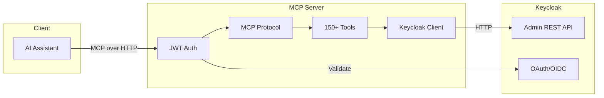

# Keycloak MCP Server

**AI-powered Keycloak administration through the Model Context Protocol**

A high-performance Rust server that bridges AI assistants with Keycloak's IAM system, exposing 150+ administration tools through the standardized MCP interface.

[Get Started](01-overview.md){ .md-button .md-button--primary }
[View on GitHub](https://github.com/if414013/rKCmcp){ .md-button }

---

<div class="grid cards" markdown>

-   :material-tools:{ .lg .middle } **150+ Tools**

    ---

    Comprehensive coverage of the Keycloak Admin REST API across 9 categories including users, clients, roles, groups, realms, auth flows, authorization, identity providers, and client scopes.

-   :material-shield-lock:{ .lg .middle } **OAuth 2.1 Security**

    ---

    JWT validation, JWKS caching, token delegation, and RBAC enforcement. The server uses Keycloak itself to secure access to its own tools.

-   :material-language-rust:{ .lg .middle } **Built with Rust**

    ---

    High-performance async runtime with memory safety guarantees. Built on Tokio, Axum, and the rmcp SDK for production-grade reliability.

-   :material-protocol:{ .lg .middle } **MCP Standard**

    ---

    Compatible with any MCP client — Claude Desktop, IDE extensions, custom agents. Uses JSON-RPC 2.0 over HTTP with streamable transport.

-   :material-check-decagram:{ .lg .middle } **Type-Safe**

    ---

    Compile-time validation with auto-generated JSON schemas for every tool. Rust's type system catches errors before they reach Keycloak.

-   :material-rocket-launch:{ .lg .middle } **Production Ready**

    ---

    Docker deployment, health checks, structured logging, and horizontal scaling. Stateless architecture runs behind any load balancer.

</div>

---

## Architecture Overview



---

## Quick Start

```bash
# Clone and build
git clone https://github.com/if414013/rKCmcp.git
cd rKCmcp
cargo build --release

# Configure
cp .env.example .env
# Edit .env with your Keycloak URL

# Run
./target/release/keycloak-mcp-server
```

!!! tip "Prerequisites"
    You'll need Rust 1.75+ and a running Keycloak 26.0+ instance. See the [full setup guide](01-overview.md#quick-start) for details.

---

## API Categories

| Category | Description | Examples |
|----------|-------------|----------|
| **Users** | Full user lifecycle management | `create_user`, `search_users_by_attribute` |
| **Clients** | OIDC and SAML client configuration | `generate_client_secret`, `configure_redirect_uris` |
| **Roles** | Realm and client role management | Role hierarchies, composite roles |
| **Groups** | Organizational structure management | Hierarchical groups, membership sync |
| **Realms** | Realm-level security policies | Token lifetimes, password policies, SMTP |
| **Authentication** | Authentication flow management | Execution priorities, MFA configuration |
| **Authorization** | Authorization Services | Resources, scopes, policies |
| **Identity Providers** | Social and enterprise federation | Google, GitHub, OIDC, SAML brokering |
| **Client Scopes** | Shared scope management | Consistent token content across apps |

---

## Documentation

<div class="grid cards" markdown>

-   [**Overview**](01-overview.md)

    Project introduction, features, and quick start guide.

-   [**Architecture**](02-architecture.md)

    Internal modules, layered design, and technology choices.

-   [**Request Flow**](03-request-flow.md)

    End-to-end request lifecycle from client to Keycloak.

-   [**Components**](04-components/keycloak-client.md)

    Deep dive into the tool registry and Keycloak client.

-   [**API Reference**](05-api-reference/index.md)

    Complete catalog of all 150+ tools with schemas.

-   [**Configuration**](06-configuration.md)

    All environment variables and deployment options.

-   [**Extending**](07-extending.md)

    Adding new tool categories or custom logic.

-   [**Troubleshooting**](08-troubleshooting.md)

    Solutions for common connectivity and setup issues.

</div>
